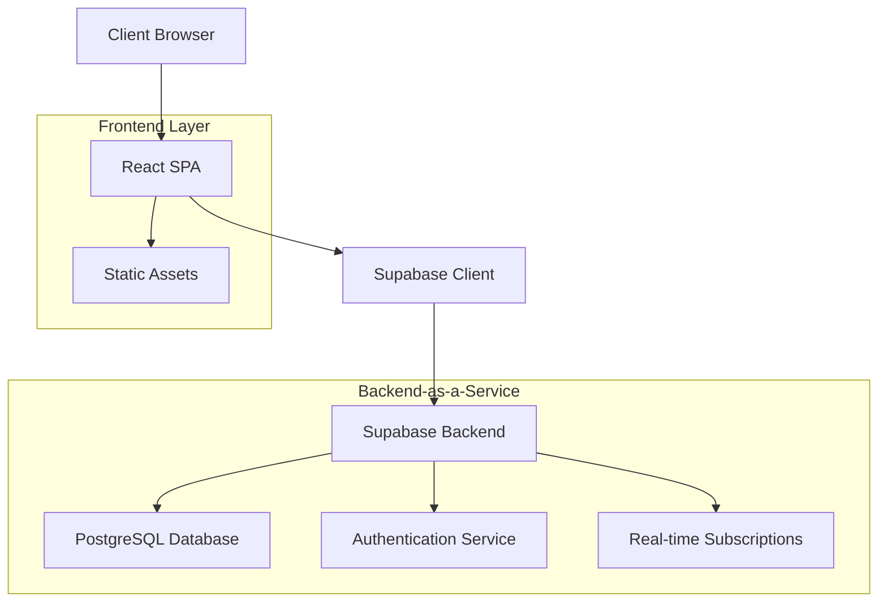
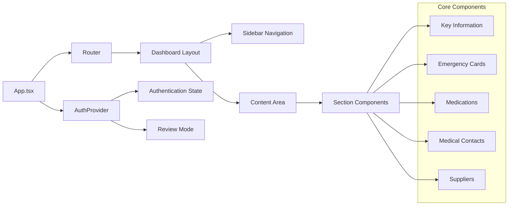
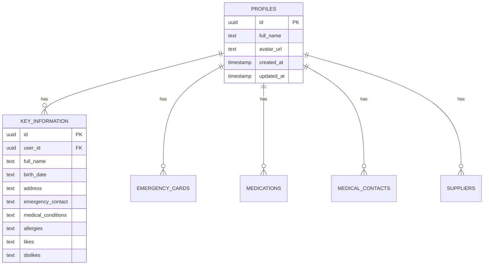

# Special Caring Application - Technical Architecture Report

**Generated:** December 25, 2024  
**Version:** 1.0  
**Document Classification:** Technical Reference - Principal Engineer Level

---

## 1. Executive Summary & Service Overview

### Business Purpose
Special Caring is a comprehensive care management platform designed for families with special-needs children. The application provides a centralized hub to organize essential care information, medical records, emergency contacts, and daily care activities. It addresses the critical need for coordinated care management in special-needs families by digitizing and organizing traditionally scattered information.

### System Classification
- **Type:** Single Page Application (SPA) with Backend-as-a-Service
- **Architecture Pattern:** Client-Server with BaaS (Supabase)
- **Deployment Model:** Static site with serverless backend
- **Data Model:** Relational database with Row-Level Security

### Critical Metrics
- **User-Centric Metrics:** Family care coordination efficiency, emergency response time reduction
- **Technical Metrics:** Authentication success rate, data persistence reliability, mobile responsiveness
- **Business Metrics:** User adoption, data completeness, care team collaboration effectiveness

### Executive Takeaways

**Top 3 Strengths:**
1. **Security-First Design:** Comprehensive Row-Level Security implementation ensuring data isolation
2. **Mobile-First Approach:** Responsive design prioritizing accessibility for caregivers on-the-go
3. **Scalable Backend:** Supabase integration providing enterprise-grade authentication and database management

**Top 3 Concerns:**
1. **File Size Management:** Large component files (Dashboard.tsx: 342 lines, AuthContext.tsx: 312 lines) requiring refactoring
2. **Missing RLS Policies:** Database tables lack proper Row-Level Security policies for data protection
3. **Limited Error Boundaries:** Insufficient error handling and fallback mechanisms

---

## 2. Service Architecture Deep Dive

### High-Level Architecture



### Component Architecture



### Design Patterns Implemented
- **Provider Pattern:** AuthContext for global authentication state
- **Compound Component Pattern:** Dashboard layout with sidebar and content areas
- **Hook Pattern:** Custom hooks for data fetching and state management
- **Route-Based Code Splitting:** Dynamic imports for section components
- **Protected Route Pattern:** Authentication guards for secure areas

### Integration Patterns
- **BaaS Integration:** Direct Supabase client integration
- **OAuth Integration:** Multiple social authentication providers
- **Real-time Updates:** Supabase real-time subscriptions for live data
- **File Upload Integration:** Support for emergency card image uploads

### Data Architecture



---

## 3. Technical Stack Analysis

### Technology Inventory

**Frontend Stack:**
- React 18.3.1 - Component framework
- TypeScript - Type safety and developer experience
- Vite - Build tool and development server
- Tailwind CSS - Utility-first styling framework
- React Router DOM 6.26.2 - Client-side routing

**UI Component Library:**
- Radix UI - Headless component primitives
- Shadcn/ui - Pre-built component system
- Lucide React 0.462.0 - Icon library
- Sonner - Toast notifications

**State Management:**
- React Context API - Global state management
- TanStack Query 5.56.2 - Server state management
- React Hook Form 7.53.0 - Form state management

**Backend Services:**
- Supabase 2.49.3 - Backend-as-a-Service
- PostgreSQL - Primary database
- Supabase Auth - Authentication service
- Supabase Realtime - Live updates

**Internationalization:**
- i18next 24.2.3 - Translation framework
- react-i18next 15.4.1 - React integration
- Language detection and switching support

### Framework Choices Rationale

**React + TypeScript:** Chosen for type safety, large ecosystem, and team familiarity
**Supabase over Custom Backend:** Reduces operational complexity while providing enterprise features
**Tailwind CSS:** Utility-first approach enables rapid UI development and consistent design
**Radix UI + Shadcn:** Provides accessible components with customizable styling

### Dependency Analysis

**Critical Dependencies:**
- @supabase/supabase-js: Core backend integration
- react-router-dom: Application navigation
- @tanstack/react-query: Data fetching and caching

**Update Policy Considerations:**
- React 18.3.1: Stable, consider React 19 migration planning
- Supabase 2.49.3: Regular updates recommended for security
- Dependencies generally up-to-date with no critical vulnerabilities

### Infrastructure Requirements

**Development Environment:**
- Node.js 18+ 
- Modern browser with ES2020 support
- Supabase CLI for local development

**Production Environment:**
- Static site hosting (Vercel, Netlify, etc.)
- CDN for asset delivery
- Supabase managed infrastructure

---

## 4. Code Quality & Engineering Practices

### Code Structure Assessment

**Strengths:**
- Clear component separation by feature/section
- Consistent file naming conventions
- Proper TypeScript type definitions
- Separation of concerns between UI and business logic

**Areas for Improvement:**
- Large component files requiring decomposition
- Missing comprehensive error boundaries
- Limited unit test coverage
- Inconsistent error handling patterns

### Development Standards

**Coding Conventions:**
- TypeScript strict mode enabled
- ESLint configuration present
- Consistent import ordering
- Proper component prop typing

**Component Patterns:**
```typescript
// Consistent prop interface definition
interface ComponentProps {
  children: React.ReactNode;
  className?: string;
}

// Proper error handling pattern
const { data, isLoading, error } = useQuery({
  queryKey: ['key'],
  queryFn: fetchData,
});
```

### Testing Strategy

**Current State:**
- No visible test files in the codebase
- No testing framework configuration detected
- Missing coverage reports

**Recommended Testing Approach:**
- Unit tests with Jest + Testing Library
- Integration tests for critical user flows
- E2E tests with Playwright for key scenarios
- Visual regression testing for UI components

### Error Handling Patterns

**Current Implementation:**
- Toast notifications for user feedback
- Try-catch blocks in authentication flows
- Console logging for debugging

**Gaps:**
- Missing error boundaries for component failures
- Inconsistent error state handling
- Limited offline support

---

## 5. Operational Excellence Assessment

### Monitoring & Observability

**Current Implementation:**
- Console logging for authentication events
- Toast notifications for user feedback
- Supabase built-in monitoring

**Missing Components:**
- Application performance monitoring
- User behavior analytics
- Error tracking and alerting
- Performance metrics collection

### Deployment Strategy

**Current Approach:**
- Static site deployment through Lovable platform
- Supabase managed backend deployment
- Environment variable configuration

**Recommended Improvements:**
- CI/CD pipeline implementation
- Staging environment setup
- Automated testing in deployment pipeline
- Blue-green deployment strategy

### Configuration Management

**Current State:**
- Supabase configuration in client.ts
- Environment-specific configurations
- Static configuration values

**Security Considerations:**
- API keys properly managed through Supabase
- No sensitive data in client-side code
- Proper CORS configuration needed

### Performance Characteristics

**Current Performance Profile:**
- Single bundle delivery
- Static asset optimization
- Database query optimization through Supabase
- Real-time updates for collaborative features

**Optimization Opportunities:**
- Code splitting by route
- Image optimization for emergency cards
- Caching strategy implementation
- Bundle size optimization

---

## 6. Security & Compliance Analysis

### Security Architecture

**Authentication & Authorization:**
```typescript
// Multi-provider authentication
const signInWithGoogle = async () => {
  const { error } = await supabase.auth.signInWithOAuth({
    provider: "google"
  });
};

// Row-Level Security at database level
// Currently missing proper RLS policies
```

**Current Security Measures:**
- Supabase authentication integration
- Session management with automatic refresh
- OAuth provider support (Google, Twitter, Facebook)
- Client-side route protection

**Security Gaps:**
- Missing Row-Level Security policies on database tables
- No comprehensive input validation
- Limited rate limiting implementation
- Missing security headers configuration

### Data Protection

**Current Implementation:**
- User data isolation through user_id foreign keys
- Encrypted data transmission (HTTPS)
- Supabase-managed encryption at rest

**Compliance Considerations:**
- HIPAA compliance requirements for medical data
- GDPR considerations for international users
- Data retention policies needed
- Audit trail implementation required

### Vulnerability Assessment

**Immediate Concerns:**
1. Database tables without RLS policies expose data risk
2. Missing input sanitization for user-generated content
3. No rate limiting on authentication endpoints
4. Client-side storage of sensitive data

**Mitigation Strategies:**
1. Implement comprehensive RLS policies
2. Add server-side validation
3. Configure Supabase rate limiting
4. Audit client-side data storage

---

## 7. Expert Knowledge Transfer

### Critical Code Paths

**Authentication Flow:**
```typescript
// AuthContext.tsx - Lines 45-85
// Critical: Session validation and token refresh
useEffect(() => {
  const { data: { subscription } } = supabase.auth.onAuthStateChange(
    async (event, session) => {
      // Session state management logic
    }
  );
}, []);
```

**Data Persistence Pattern:**
```typescript
// Standard pattern for Supabase operations
const { data, error } = await supabase
  .from('table_name')
  .insert(values)
  .select();
```

**Component Layout Structure:**
```typescript
// Dashboard.tsx - Core layout component
// Manages sidebar state and content routing
const DashboardLayout = ({ children }) => {
  // Sidebar collapse logic
  // Mobile responsive behavior
  // Authentication-based rendering
};
```

### Common Operations

**Daily Tasks:**
1. User registration and authentication testing
2. Data entry form validation
3. Mobile responsiveness verification
4. Cross-browser compatibility checks

**Troubleshooting Procedures:**
1. Check browser console for authentication errors
2. Verify Supabase connection status
3. Validate RLS policies for data access issues
4. Test responsive design across devices

### Historical Context

**Architecture Evolution:**
- Started as authentication-focused application
- Evolved to comprehensive care management platform
- Added internationalization support
- Implemented review mode for demonstrations

**Key Architectural Decisions:**
- Chose Supabase over custom backend for rapid development
- Implemented client-side routing for SPA experience
- Selected Tailwind CSS for consistent design system
- Used React Context for global state management

### Tribal Knowledge

**Undocumented Behaviors:**
1. Review mode bypasses authentication for demonstrations
2. Mobile sidebar auto-closes on navigation
3. Authentication state persists across browser sessions
4. Form data auto-saves on input changes

**Expert Tips:**
1. Always test authentication flows in incognito mode
2. Mobile-first development approach is critical
3. Supabase RLS policies must be tested thoroughly
4. Toast notifications provide user feedback patterns

**Common Gotchas:**
1. Missing RLS policies cause data access failures
2. Large component files impact development velocity
3. Authentication redirects can cause infinite loops
4. TypeScript errors from missing database columns

---

## 8. Future-Proofing Assessment

### Technical Debt Analysis

**High Priority Debt:**
1. **Large Component Files** - Dashboard.tsx (342 lines), AuthContext.tsx (312 lines)
   - Impact: Reduced maintainability, slower development
   - Effort: 2-3 sprints
   - ROI: High - Improved development velocity

2. **Missing RLS Policies** - Database tables lack proper security
   - Impact: Critical security vulnerability
   - Effort: 1 sprint
   - ROI: Critical - Security compliance

3. **Limited Error Handling** - Insufficient error boundaries
   - Impact: Poor user experience on failures
   - Effort: 1-2 sprints
   - ROI: Medium - Improved reliability

**Medium Priority Debt:**
1. Missing test coverage
2. No performance monitoring
3. Limited offline support
4. Manual deployment process

### Modernization Opportunities

**Framework Upgrades:**
- React 19 migration planning
- Supabase v3 preparation
- TypeScript 5.x adoption
- Vite 5.x upgrade path

**Refactoring Candidates:**
```typescript
// Current large component pattern
const Dashboard = () => {
  // 342 lines of mixed concerns
};

// Target modular pattern
const Dashboard = () => {
  return (
    <DashboardLayout>
      <DashboardContent />
    </DashboardLayout>
  );
};
```

### Scalability Roadmap

**Current Limitations:**
- Single-tenant data model
- Client-side only architecture
- Limited real-time collaboration
- No caching strategy

**Growth Planning:**
1. **0-10K Users:** Current architecture sufficient
2. **10K-100K Users:** Implement caching, CDN optimization
3. **100K+ Users:** Consider microservices, database sharding

### Risk Assessment

**Technical Risks:**
1. **High:** Missing RLS policies - Security breach potential
2. **Medium:** Large components - Development velocity impact
3. **Medium:** No error boundaries - Application stability
4. **Low:** Dependency updates - Compatibility issues

**Mitigation Strategies:**
1. Immediate RLS policy implementation
2. Component refactoring sprint planning
3. Error boundary implementation
4. Automated dependency monitoring

---

## 9. Onboarding Accelerator

### Quick Start Guide

**Prerequisites:**
```bash
# Required tools
node --version  # >= 18
npm --version   # >= 8
git --version   # >= 2.30
```

**Development Setup:**
```bash
# 1. Clone and setup
git clone <repository-url>
cd special-caring
npm install

# 2. Start development server
npm run dev

# 3. Access application
open http://localhost:5173
```

**First Contribution Checklist:**
1. [ ] Verify authentication works
2. [ ] Test responsive design on mobile
3. [ ] Check console for errors
4. [ ] Validate TypeScript compilation
5. [ ] Test database operations

### Development Environment

**IDE Configuration:**
- VS Code with TypeScript extension
- ESLint and Prettier extensions
- Tailwind CSS IntelliSense
- Auto-save configuration recommended

**Debugging Setup:**
```typescript
// Enable detailed logging
localStorage.setItem('debug', 'supabase:*');

// Check authentication state
console.log('Auth state:', supabase.auth.getSession());
```

### Testing Procedures

**Manual Testing Checklist:**
1. Authentication flows (login, logout, registration)
2. Data persistence across page refreshes
3. Mobile responsive behavior
4. Cross-browser compatibility
5. Error state handling

**Component Testing Pattern:**
```typescript
// Recommended testing approach
import { render, screen } from '@testing-library/react';
import { AuthProvider } from '@/contexts/AuthContext';

const renderWithAuth = (component) => {
  return render(
    <AuthProvider>
      {component}
    </AuthProvider>
  );
};
```

### Key Contacts & Escalation

**Subject Matter Experts:**
- Authentication & Security: Review AuthContext.tsx implementation
- UI/UX Components: Consult Dashboard.tsx and section components
- Database Schema: Reference Supabase types and table definitions
- Internationalization: Check i18n configuration and locale files

---

## 10. Strategic Recommendations

### Immediate Actions (Priority: Critical)

**1. Implement Row-Level Security Policies**
```sql
-- Example RLS policy needed
CREATE POLICY "Users can only see own data" ON key_information 
FOR ALL USING (auth.uid() = user_id);
```
- **Timeline:** 1 week
- **Effort:** 8-16 hours
- **Success Criteria:** All database tables have proper RLS policies

**2. Add Error Boundaries**
```typescript
class ErrorBoundary extends React.Component {
  constructor(props) {
    super(props);
    this.state = { hasError: false };
  }
  // Implementation needed
}
```
- **Timeline:** 1 week  
- **Effort:** 8-12 hours
- **Success Criteria:** Application gracefully handles component failures

### Short-term Improvements (0-3 months)

**1. Component Refactoring**
- Break down large components (Dashboard.tsx, AuthContext.tsx)
- **Timeline:** 2-3 sprints
- **Effort:** 40-60 hours
- **Success Criteria:** No component exceeds 150 lines

**2. Testing Implementation**
- Unit tests for critical components
- Integration tests for user flows
- **Timeline:** 1-2 months
- **Effort:** 80-120 hours
- **Success Criteria:** 70%+ test coverage

**3. Performance Optimization**
- Code splitting implementation
- Image optimization
- **Timeline:** 1 month
- **Effort:** 20-30 hours
- **Success Criteria:** <3s initial load time

### Medium-term Strategy (3-12 months)

**1. Enhanced Security Implementation**
- Comprehensive input validation
- Security audit and penetration testing
- **Timeline:** 3-4 months
- **Effort:** 120-160 hours
- **Success Criteria:** Security compliance certification

**2. Advanced Features**
- Real-time collaboration
- Offline support
- Advanced reporting
- **Timeline:** 6-8 months
- **Effort:** 200-300 hours
- **Success Criteria:** Feature parity with enterprise solutions

**3. Scalability Preparation**
- Caching implementation
- Performance monitoring
- Database optimization
- **Timeline:** 4-6 months
- **Effort:** 100-150 hours
- **Success Criteria:** Support for 10K+ concurrent users

### Long-term Vision (1+ years)

**1. Platform Evolution**
- Multi-tenant architecture
- API-first design
- Microservices consideration
- **Timeline:** 12-18 months
- **Effort:** 500+ hours
- **Success Criteria:** Enterprise-ready platform

**2. Advanced Analytics**
- Machine learning integration
- Predictive care recommendations
- Advanced reporting dashboard
- **Timeline:** 18-24 months
- **Effort:** 300-400 hours
- **Success Criteria:** AI-powered care insights

---

## Conclusion

Special Caring represents a well-architected foundation for a comprehensive care management platform. The application demonstrates strong security awareness, mobile-first design principles, and scalable backend integration through Supabase.

The immediate focus should be on implementing proper Row-Level Security policies and component refactoring to address technical debt. The medium-term roadmap should prioritize testing implementation and performance optimization, while long-term planning should consider platform evolution and advanced analytics capabilities.

With proper execution of these recommendations, Special Caring can evolve from a functional care management tool to an enterprise-grade platform serving the special-needs community at scale.

---

**Document Maintenance:**
- **Next Review:** Q2 2025
- **Update Trigger:** Major architectural changes, security updates, or framework migrations
- **Owner:** Principal Engineering Team
- **Distribution:** Technical stakeholders, senior engineers, architecture review board
